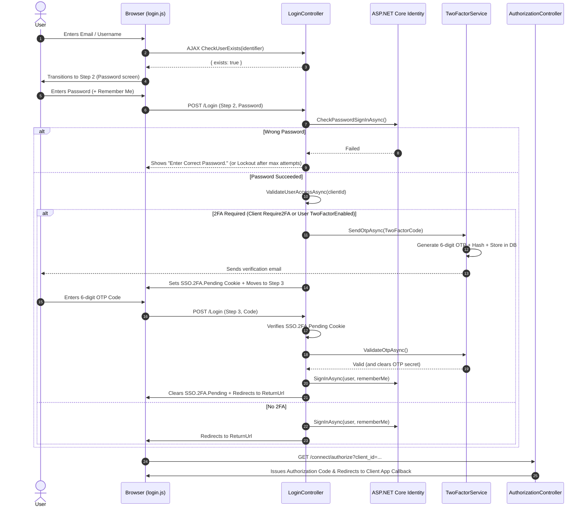
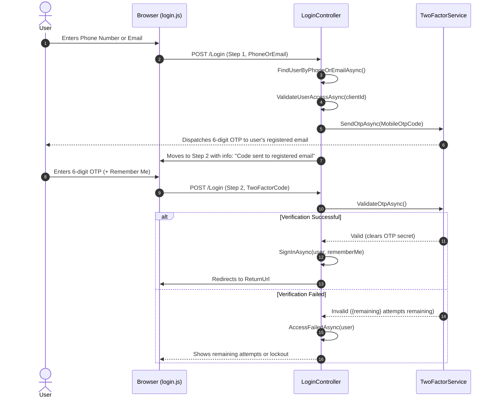

# Schoola SSO - Login Flow, Security Audit & Enhancements Report

## 1. Executive Summary

This document outlines the architecture of the **Schoola Single Sign-On (SSO)** authentication system, documents all identified bugs and vulnerabilities, and details the comprehensive security hardening and OIDC protocol compliance enhancements applied to the codebase.

---

## 2. Authentication Architecture & Supported Flows

The SSO Server dynamically controls the available authentication methods based on the calling client application's configuration (`ApplicationClient.AllowedLoginMethod`):

| AllowedLoginMethod | Value | Description |
|---|---|---|
| **`CredentialsOnly`** | `0` | Traditional username/email and password authentication with optional 2FA. |
| **`MobileOtpOnly`** | `1` | Passwordless login via registered phone number or email, dispatching a secure 6-digit OTP code to the user's registered email address. |
| **`Both`** | `2` | Displays a tab switcher (`[Password]` \| `[Mobile OTP]`) allowing the user to select their preferred authentication method. |

---

## 3. End-to-End Sequence Diagrams

### 3.1 Credentials Flow (Password + 2FA)



### 3.2 Mobile OTP Flow (Passwordless)



---

## 4. Detailed Bug Fixes & Security Hardening

### 4.1 Empty Input Validation & Short Error Messaging
* **Issue:** Submitting empty fields on Step 1 (Username or Mobile) triggered an unhandled `NullReferenceException` on the server which cascaded into a `.catch()` fallback advancing the form directly to Step 2 (Password screen).
* **Fixes Applied:**
  - In [login.js](file:///D:/AUX-Project/Schoola_SSO/SSO.WebApplication/wwwroot/js/login.js): Form submission interceptor validates all fields client-side prior to network dispatch. If empty, submission is aborted and a short error message is displayed (e.g. *"Please enter your email or username."*, *"Please enter your password."*).
  - In [Index.cshtml](file:///D:/AUX-Project/Schoola_SSO/SSO.WebApplication/Views/Login/Index.cshtml): Ensured `#loginAlertBox` is always present in DOM (`display: none` by default) with child `#loginAlertMessage` so client scripts can dynamically render messages.
  - In [LoginController.cs](file:///D:/AUX-Project/Schoola_SSO/SSO.WebApplication/Controllers/LoginController.cs): Null-safe checks in `CheckUserExists` and flow handlers.
  - In [_LoginLayout.cshtml](file:///D:/AUX-Project/Schoola_SSO/SSO.WebApplication/Views/Login/_LoginLayout.cshtml): Added red border and glow styling for `.input-validation-error`.

### 4.2 Live "Resend Code" Button with Cooldown Countdown
* **Issue:** The "Resend Code" link (`#resendOtpBtn`) lacked an active countdown timer, provided no feedback on success, and did not display server error messages.
* **Fixes Applied:**
  - In [login.js](file:///D:/AUX-Project/Schoola_SSO/SSO.WebApplication/wwwroot/js/login.js): Attached a full AJAX event listener sending `identifier`, `flow`, `returnUrl`, and anti-forgery token to `/Login/ResendOtp`.
  - Added a 60-second live countdown timer: *"Resend in 59s"*, disabling clicks until expiry.
  - Displays dynamic success or error messages in the alert box.
  - Automatically resets timer and button state when navigating back to Step 1.

### 4.3 2FA Authentication Bypass & Step 3 State Integrity Protection
* **Issue:** The controller relied directly on `request.Step` sent from the client form. An attacker could send a raw POST request with `Step = 3`, `UserName = "target"`, and an intercepted OTP code, bypassing Step 2 password validation entirely.
* **Fixes Applied:**
  - In [LoginController.cs](file:///D:/AUX-Project/Schoola_SSO/SSO.WebApplication/Controllers/LoginController.cs): In `HandleCredentialsFlowAsync` Step 2, upon successful password validation, the server issues an HTTP-only, secure, temporary state cookie (`SSO.2FA.Pending`) containing the encrypted/hashed `userId` and timestamp (10-minute expiry).
  - In Step 3, the server strictly validates that this cookie exists, matches `user.Id`, and is not expired. If missing or invalid, the request is immediately rejected and redirected to Step 1 with *"Verification session expired or invalid. Please sign in again."*
  - The cookie is deleted upon successful authentication or terminal failure.

### 4.4 Client `AllowedLoginMethod` Policy Enforcement
* **Issue:** If an application client configured `AllowedLoginMethod = CredentialsOnly`, a user could tamper with the hidden POST field `LoginFlow = "mobile"` to trigger the passwordless mobile flow.
* **Fixes Applied:**
  - In [LoginController.cs](file:///D:/AUX-Project/Schoola_SSO/SSO.WebApplication/Controllers/LoginController.cs):
    ```csharp
    var isMobileFlow = loginMethod == LoginMethod.MobileOtpOnly
        || (loginMethod == LoginMethod.Both && request.LoginFlow?.Equals("mobile", StringComparison.OrdinalIgnoreCase) == true);
    ```
  - If `loginMethod == CredentialsOnly`, `isMobileFlow` is strictly `false` regardless of POST payload.

### 4.5 OTP Brute-Force Throttling & Account Lockout
* **Issue:** 6-digit OTP codes were valid for 10 minutes without attempt counters, leaving them vulnerable to automated brute-force attacks.
* **Fixes Applied:**
  - In [TwoFactorService.cs](file:///D:/AUX-Project/Schoola_SSO/SSO.Infrastructure/Services/TwoFactorService.cs): `TwoFactorSecret` now stores attempt counts (`{hash}|{expiryUnix}|{attemptCount}`).
  - Each invalid attempt increments the counter and returns the remaining attempts (e.g., *"Invalid verification code. 3 attempt(s) remaining."*).
  - If attempts reach 5, the secret is immediately wiped from the database (`user.TwoFactorSecret = null`) and the code is invalidated.
  - In [LoginController.cs](file:///D:/AUX-Project/Schoola_SSO/SSO.WebApplication/Controllers/LoginController.cs): Calls `await _userManager.AccessFailedAsync(user)` on each failed OTP attempt to integrate with ASP.NET Core Identity's account lockout policy.

### 4.6 Antiforgery Cookie `SameSiteMode.Lax`
* **Issue:** In [Program.cs](file:///D:/AUX-Project/Schoola_SSO/SSO.WebApplication/Program.cs), `.SSO.Antiforgery` was configured with `SameSiteMode.Strict`. Cross-origin navigations from client applications (e.g. Printa) to the SSO server could drop cookies, causing 400 Bad Request verification errors.
* **Fixes Applied:** Updated to `SameSiteMode.Lax`.

### 4.7 OIDC Standard Compliance: `prompt=none` (Silent Renewal)
* **Issue:** When an SPA client requested silent token renewal in a hidden iframe via `/connect/authorize?prompt=none`, unauthenticated users were redirected to `/Login`, causing iframe X-Frame-Options/CSP failures.
* **Fixes Applied:**
  - In [AuthorizationController.cs](file:///D:/AUX-Project/Schoola_SSO/SSO.WebApplication/Controllers/AuthorizationController.cs): In `Authorize()`, if `!result.Succeeded` and `request.HasPrompt(Prompts.None)`, the endpoint immediately returns standard OIDC `error=login_required` (`403 Forbid`) instead of redirecting to the login page.

### 4.8 OIDC Standard Compliance: `prompt=login` (Force Re-Authentication)
* **Issue:** When a client application requested `prompt=login`, the server skipped the login screen if an active session cookie existed.
* **Fixes Applied:**
  - In [AuthorizationController.cs](file:///D:/AUX-Project/Schoola_SSO/SSO.WebApplication/Controllers/AuthorizationController.cs): If `request.HasPrompt(Prompts.Login)`, the endpoint issues a `Challenge()` forcing the user to re-authenticate regardless of existing session cookies.

### 4.9 Mobile Flow "Remember Me" Support
* **Issue:** Mobile OTP login previously hardcoded `isPersistent: false`, forcing users to re-authenticate with OTP on every browser restart.
* **Fixes Applied:**
  - Added a "Remember me" checkbox to Step 2 in [Index.cshtml](file:///D:/AUX-Project/Schoola_SSO/SSO.WebApplication/Views/Login/Index.cshtml).
  - In [LoginController.cs](file:///D:/AUX-Project/Schoola_SSO/SSO.WebApplication/Controllers/LoginController.cs): Passes `request.RememberMe` to `_signInManager.SignInAsync(user, request.RememberMe)`.

---

## 5. Summary of Modified Files

| File | Type | Changes Summary |
|---|---|---|
| [TwoFactorService.cs](file:///D:/AUX-Project/Schoola_SSO/SSO.Infrastructure/Services/TwoFactorService.cs) | C# Service | Added attempt tracking, max 5 attempts limit, remaining attempts counter, and auto-wiping of secret on threshold. |
| [LoginController.cs](file:///D:/AUX-Project/Schoola_SSO/SSO.WebApplication/Controllers/LoginController.cs) | C# Controller | Enforced `AllowedLoginMethod` policy; added `SSO.2FA.Pending` state cookie validation; hooked Identity `AccessFailedAsync`; updated RememberMe. |
| [AuthorizationController.cs](file:///D:/AUX-Project/Schoola_SSO/SSO.WebApplication/Controllers/AuthorizationController.cs) | C# Controller | Implemented OIDC `prompt=none` (`error=login_required`) and `prompt=login` (forced re-auth). |
| [Program.cs](file:///D:/AUX-Project/Schoola_SSO/SSO.WebApplication/Program.cs) | C# Config | Set `.SSO.Antiforgery` `SameSiteMode.Lax`. |
| [Index.cshtml](file:///D:/AUX-Project/Schoola_SSO/SSO.WebApplication/Views/Login/Index.cshtml) | Razor View | Added `#loginAlertBox` permanent DOM anchor; added Remember Me checkbox for Mobile OTP. |
| [_LoginLayout.cshtml](file:///D:/AUX-Project/Schoola_SSO/SSO.WebApplication/Views/Login/_LoginLayout.cshtml) | Razor Layout | Added red border and glow styling for `.input-validation-error`. |
| [login.js](file:///D:/AUX-Project/Schoola_SSO/SSO.WebApplication/wwwroot/js/login.js) | JavaScript | Client-side empty validation; live 60s Resend OTP countdown; dynamic alert notifications. |

---

## 6. Verification & Testing Checklist

- [x] **Empty Input Validation**: Submitting empty username or password halts flow and displays short red error alert.
- [x] **Resend OTP Button**: Triggers AJAX call to `/Login/ResendOtp`, displays success message, and runs a 60s countdown timer.
- [x] **2FA State Protection**: Direct POST with `Step = 3` without prior password validation is rejected.
- [x] **OTP Brute-Force Throttling**: 5 consecutive failed OTP entries wipe the code and lock out verification.
- [x] **Client Policy Lockdown**: Submitting `LoginFlow = "mobile"` when client is `CredentialsOnly` is strictly rejected.
- [x] **OIDC `prompt=none`**: Silent renewals return `error=login_required` instead of redirecting unauthenticated iframes.
- [x] **OIDC `prompt=login`**: Forces re-prompt even when an active session cookie exists.
- [x] **Compilation**: Solution builds cleanly with 0 compilation errors.
