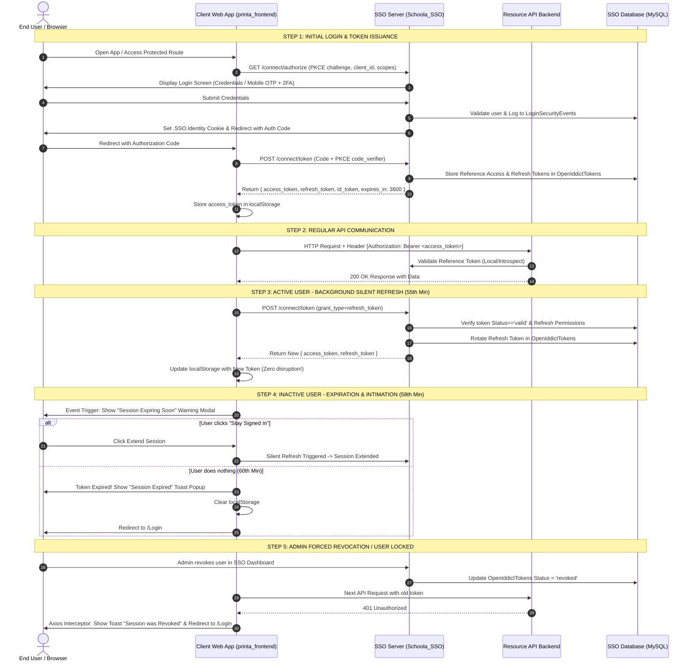

# STANDARD OPERATING PROCEDURE (SOP)
## Enterprise SSO: Token Architecture, Session Lifecycle, Auto-Refresh & Expiration Handling

**Document Version:** 1.0.0  
**Target Systems:** `Schoola_SSO` (SSO Identity Provider Server) & `Printa` / Client Applications (`printa_frontend`, Mobile Apps, Client APIs)  
**Security Framework:** OpenID Connect (OIDC) & OAuth 2.0 with PKCE & Reference Tokens  

---

## 📑 Table of Contents
1. [Executive Summary & Core Concepts](#1-executive-summary--core-concepts)
2. [Token Types & Specifications Matrix](#2-token-types--specifications-matrix)
3. [End-to-End System Architecture Diagram](#3-end-to-end-system-architecture-diagram)
4. [SSO Server Deep Dive (Schoola_SSO)](#4-sso-server-deep-dive-schoola_sso)
   - 4.1 Token Issuance & Lifetimes
   - 4.2 Multi-Step Login & Cookie Sessions
   - 4.3 Authorization & Dynamic Permission Enrichment
   - 4.4 Reference Token Storage in Database
   - 4.5 Refresh Token Rotation & Live Permission Refresh
   - 4.6 Token Revocation & Introspection
5. [Client Application Deep Dive (printa_frontend)](#5-client-application-deep-dive-printa_frontend)
   - 5.1 OIDC Client Configuration
   - 5.2 Background Silent Token Renew
   - 5.3 Session Expiry Event Listeners & Warning Popup
   - 5.4 Axios Request & 401 Response Interceptors
6. [Active User Monitoring & Security Auditing](#6-active-user-monitoring--security-auditing)
   - 6.1 Database Audit Tables
   - 6.2 SSO Admin Security Dashboard
   - 6.3 Background Job Monitoring
7. [Step-by-Step Implementation Guide for the Team](#7-step-by-step-implementation-guide-for-the-team)
8. [Troubleshooting & Verification Checklist](#8-troubleshooting--verification-checklist)

---

## 1. Executive Summary & Core Concepts

Intha Standard Operating Procedure (SOP) document `Schoola_SSO` (Identity Provider) and Client Applications (`printa_frontend`, Web/Mobile Apps)-kku naduvil nadakkura **Token Lifecycle**, **Authentication**, **Automatic Token Refresh**, **Session Expiration Intimation (Popups/Modals)**, and **Live User Monitoring** patriya complete technical and implementation guide aagum.

### Core Objectives:
* **Single Sign-On (SSO):** User oru murai login seithaal, Schoola ecosystem-il ulla anaithu applications-kum (Printa, Management Portal, APIs) seamless access kedaikkum.
* **Instant Revocation via Reference Tokens:** Central database-il tokens record aavathaal, admin user-ai deactivate seitha udane anaithu active sessions instant-aagavum revoke aagum.
* **Zero Disruption for Active Users:** Active user continuous-aaga work seiyumpothu background silent refresh moolama session maintain aagum.
* **Proactive Security Intimation:** Inactive user-kku session expire aaga 2 nimidangalukku munbu warning modal-um, expire aanaal explicit notification toast-um kaattapadum.

---

## 2. Token Types & Specifications Matrix

| Token Type | Issuer Endpoint | Format & Storage | Expiration Time | Purpose & Usage |
| :--- | :--- | :--- | :--- | :--- |
| **1. Identity Cookie** (`.SSO.Identity`) | SSO Web Portal (`LoginController`) | Encrypted Cookie (ASP.NET DataProtection) | 480 mins (8 Hours) (Sliding) | SSO Server Portal-il user authenticated-aa endru maintain seiya. |
| **2. Authorization Code** | `/connect/authorize` | Short-lived Opaque String | 5 Minutes (Single-use) | Client App PKCE flow-il tokens exchange seiya payanpadum code. |
| **3. Access Token** | `/connect/token` | **Reference Token** (Opaque DB-backed) | 60 Minutes (1 Hour) | Client Application Resource Server / Backend APIs access seiya. |
| **4. Refresh Token** | `/connect/token` | **Reference Token** (Opaque DB-backed) | 14 Days (Sliding/Rotated) | Access Token expire aana piragu user password illamal puthiya Access Token vaanga. |
| **5. ID Token** | `/connect/token` | Signed JWT (`RS256`) | 60 Minutes | Client App user profile details (Name, Email, Roles, Sub) ariyalaam. |
| **6. RPAP Launch Token** | `ManagementController` | Ephemeral SHA256 Token | 2 Minutes (Single-use) | Mobile App-il irunthu Admin Web View-kku secure deep linking seiya. |

---

## 3. End-to-End System Architecture Diagram



---

## 4. SSO Server Deep Dive (`Schoola_SSO`)

### 4.1 Token Configuration & Lifetimes (`ServiceCollectionExtentions.cs`)
SSO Server-il OpenIddict configure seiyappattu Reference Tokens and lifespan enforce seiyappadugirathu:

```csharp
// Path: SSO.Infrastructure/Extentions/ServiceCollectionExtentions.cs
services.AddOpenIddict()
    .AddCore(options =>
    {
        options.UseEntityFrameworkCore()
               .UseDbContext<ApplicationDbContext>()
               .ReplaceDefaultEntities<ApplicationClient, ApplicationAuthorization, ApplicationScope, ApplicationToken, Guid>();
    })
    .AddServer(options =>
    {
        // Endpoints
        options.SetAuthorizationEndpointUris("/connect/authorize")
               .SetTokenEndpointUris("/connect/token")
               .SetRevocationEndpointUris("/connect/revoke")
               .SetIntrospectionEndpointUris("/connect/introspect")
               .SetEndSessionEndpointUris("/connect/endsession");

        // Flows
        options.AllowAuthorizationCodeFlow()
               .AllowRefreshTokenFlow()
               .AllowClientCredentialsFlow();

        // Token Types
        options.UseReferenceAccessTokens()
               .UseReferenceRefreshTokens();

        // Security Hardening
        options.RequireProofKeyForCodeExchange();

        // Explicit Token Lifespans
        options.SetAccessTokenLifetime(TimeSpan.FromHours(1))
               .SetRefreshTokenLifetime(TimeSpan.FromDays(14))
               .SetAuthorizationCodeLifetime(TimeSpan.FromMinutes(5));
    });
```

---

### 4.2 Multi-Step Login & Cookie Sessions (`LoginController.cs`)
* **Flows Supported:** Standard Password flow with optional 2FA OTP, Mobile OTP passwordless flow, and Password Reset flow.
* **Cookie Generation:** Authenticated aana udane `_signInManager.SignInAsync(user, isPersistent)` `.SSO.Identity` cookie-ai create seiyum.
* **Security Event Logging:** Ovvoru login attempt (Success, PasswordFailed, OtpFailed, AccountLocked, AccessDenied) [SecurityEventService.cs](file:///d:/AUX-Project/Schoola_SSO/SSO.Infrastructure/Services/SecurityEventService.cs) moolama `LoginSecurityEvents` table-il Client IP, GeoIP Country/City, Browser, OS, DeviceType ullaadata record seiyappadugirathu.

---

### 4.3 Authorization & Dynamic Permission Enrichment (`AuthorizationController.cs`)
Client App `/connect/authorize` endpoint-ai call seiyumpothu:
1. User-oda client access license validate aagiradhu: `_accessControlService.ValidateUserAccessAsync(user, clientId)`.
2. Principal tenant claims-udan enrich aagiradhu (`TenantId`, `TenantName`, `TenantCode`, `TenantDatabaseProvider`).
3. `RolePermissions` table-il irunthu dynamic client-specific permissions fetch seithu token claims-il add seiyappadugirathu ([AuthorizationController.cs:L138-L152](file:///d:/AUX-Project/Schoola_SSO/SSO.WebApplication/Controllers/AuthorizationController.cs#L138-L152)).

---

### 4.4 Reference Token Storage in Database
OpenIddict database-il tokens store seiyum table mapping:

* **Table `OpenIddictTokens` (`ApplicationToken.cs`):**
  * `Id`: Unique Token GUID.
  * `Subject`: User ID (GUID).
  * `Type`: `access_token` or `refresh_token`.
  * `Status`: `valid`, `revoked`, or `inactive`.
  * `ExpirationDate`: UTC expiry timestamp.
  * `ReferenceId`: Opaque lookup key sent to the client.
  * `Payload`: JSON payload containing claims and metadata.
  * `DeviceInfo`: Client device fingerprint.

---

### 4.5 Refresh Token Rotation & Live Permission Refresh
Client App `/connect/token` endpoint-il `grant_type=refresh_token` anupumpothu:
* OpenIddict existing refresh token status `valid`-aa endru check seiyum.
* `_signInManager.CanSignInAsync(user)` user innum active-aa endru verify seiyum.
* **Live Permission Refresh:** User-in permissions edhavadhu maari irunthaal, puthiya access token-il fresh permissions load aagum ([AuthorizationController.cs:L329-L354](file:///d:/AUX-Project/Schoola_SSO/SSO.WebApplication/Controllers/AuthorizationController.cs#L329-L354)).

---

### 4.6 Token Revocation & Introspection
* **`/connect/introspect`:** Resource APIs token valid-aa endru check seiya payload lookup nadakkum.
* **`/connect/revoke`:** User logout aagumpotho or session terminate aagumpotho token status-ai `revoked` endru maatri invalid seiyum.

---

## 5. Client Application Deep Dive (`printa_frontend`)

---

### 5.1 OIDC Client Configuration (`OidcProvider.jsx`)
`printa_frontend` library `react-oidc-context` payanpaduthugirathu. Ingu `automaticSilentRenew: true` set seiya vendum.

```javascript
// Path: printa_frontend/src/sso/OidcProvider.jsx
"use client";

import { AuthProvider as ReactOidcAuthProvider } from "react-oidc-context";
import { useEffect, useState } from "react";
import { cleanEnvVar, getSsoBaseUrl } from "./ssoUtils";

const ssoBaseUrl = getSsoBaseUrl();
const issuerUrl = `${ssoBaseUrl}/`;

const clientId = cleanEnvVar(process.env.NEXT_PUBLIC_CLIENT_ID) || "printa-spa-test";
const backendClientId = cleanEnvVar(process.env.NEXT_PUBLIC_BACKEND_CLIENT_ID) || "printa-api-test";

const metadata = {
  issuer: issuerUrl,
  authorization_endpoint: `${ssoBaseUrl}/connect/authorize`,
  token_endpoint: `${ssoBaseUrl}/connect/token`,
  introspection_endpoint: `${ssoBaseUrl}/connect/introspect`,
  end_session_endpoint: `${ssoBaseUrl}/connect/endsession`,
  revocation_endpoint: `${ssoBaseUrl}/connect/revoke`,
  userinfo_endpoint: `${ssoBaseUrl}/connect/userinfo`,
  jwks_uri: `${ssoBaseUrl}/.well-known/jwks`,
};

export default function OidcProvider({ children }) {
  const [origin, setOrigin] = useState("");

  useEffect(() => {
    if (typeof window !== "undefined") {
      setOrigin(window.location.origin);
    }
  }, []);

  const currentOrigin = origin || (typeof window !== "undefined" ? window.location.origin : "http://localhost:3000");
  const redirectUri = `${currentOrigin}/api/auth/callback/printa-sso`;

  const oidcConfig = {
    authority: issuerUrl,
    metadata,
    client_id: clientId,
    redirect_uri: redirectUri,
    post_logout_redirect_uri: `${currentOrigin}/login`,
    response_type: "code",
    scope: `openid profile email offline_access ${backendClientId}`,
    loadUserInfo: true,
    
    // ✅ ENABLE AUTOMATIC SILENT TOKEN REFRESH
    automaticSilentRenew: true,

    onSigninCallback: (_user) => {
      if (typeof window !== "undefined") {
        window.history.replaceState({}, document.title, window.location.pathname);
      }
    },
  };

  return (
    <ReactOidcAuthProvider key={redirectUri} {...oidcConfig}>
      {children}
    </ReactOidcAuthProvider>
  );
}
```

---

### 5.2 Session Expiry Event Listeners & Warning Popup (`AppAuthContext.jsx`)
OIDC events-ai listen seithu warning modal and expiration toast trigger seiyum logic:

```javascript
// Path: printa_frontend/src/sso/AppAuthContext.jsx
"use client";

import { createContext, useContext, useEffect, useState } from "react";
import { useAuth as useOidcAuth } from "react-oidc-context";
import { usePathname, useRouter } from "next/navigation";
import toast from "react-hot-toast";

import LoginLoader from "@/components/ui/LoginLoader";
import SessionExpiryModal from "@/components/ui/SessionExpiryModal";
import { getSsoBaseUrl, cleanEnvVar } from "./ssoUtils";
import { usersApi } from "@/service/apiservice";

const AppAuthContext = createContext(null);

export const AppAuthProvider = ({ children }) => {
  const oidcAuth = useOidcAuth();
  const pathname = usePathname();
  const router = useRouter();

  const [loading, setLoading] = useState(true);
  const [showWarningModal, setShowWarningModal] = useState(false);

  // ── OIDC Token Lifecycle Event Listeners ─────────────────────────────────
  useEffect(() => {
    if (!oidcAuth?.events) return;

    // 1. Triggered when token is renewed successfully
    const onUserLoaded = (user) => {
      if (user?.access_token) {
        localStorage.setItem("token", user.access_token);
        setShowWarningModal(false);
      }
    };

    // 2. Triggered ~2 mins before token expires (Inactivity)
    const onTokenExpiring = () => {
      setShowWarningModal(true);
    };

    // 3. Triggered when token has completely expired
    const onTokenExpired = () => {
      setShowWarningModal(false);
      localStorage.removeItem("token");
      toast.error("Your session has expired. Please log in again.", {
        id: "session-expired-toast",
        duration: 4000,
      });
      setTimeout(() => {
        if (oidcAuth?.signinRedirect) {
          oidcAuth.signinRedirect();
        } else {
          router.push("/login");
        }
      }, 1500);
    };

    // 4. Triggered if background renew fails (e.g. user locked out)
    const onSilentRenewError = (error) => {
      console.warn("Silent renew failed:", error);
    };

    oidcAuth.events.addUserLoaded(onUserLoaded);
    oidcAuth.events.addAccessTokenExpiring(onTokenExpiring);
    oidcAuth.events.addAccessTokenExpired(onTokenExpired);
    oidcAuth.events.addSilentRenewError(onSilentRenewError);

    return () => {
      oidcAuth.events.removeUserLoaded(onUserLoaded);
      oidcAuth.events.removeAccessTokenExpiring(onTokenExpiring);
      oidcAuth.events.removeAccessTokenExpired(onTokenExpired);
      oidcAuth.events.removeSilentRenewError(onSilentRenewError);
    };
  }, [oidcAuth, router]);

  const handleExtendSession = async () => {
    try {
      if (oidcAuth?.signinSilent) {
        await oidcAuth.signinSilent();
        setShowWarningModal(false);
        toast.success("Session extended successfully!");
      }
    } catch (err) {
      console.error("Failed to extend session:", err);
      if (oidcAuth?.signinRedirect) {
        await oidcAuth.signinRedirect();
      }
    }
  };

  const handleLogout = async () => {
    try {
      if (typeof window !== "undefined") {
        window.dispatchEvent(new CustomEvent("auth:signout"));
      }
      await new Promise((resolve) => setTimeout(resolve, 300));
      localStorage.removeItem("token");
      if (oidcAuth?.removeUser) await oidcAuth.removeUser();
      if (oidcAuth?.signoutRedirect) await oidcAuth.signoutRedirect();
    } catch (err) {
      console.error("Error during SSO logout:", err);
    }
  };

  return (
    <AppAuthContext.Provider
      value={{
        user: oidcAuth?.user,
        loading: loading || (oidcAuth?.isLoading ?? false),
        isAuthenticated: oidcAuth?.isAuthenticated ?? false,
        login: () => oidcAuth?.signinRedirect(),
        logout: handleLogout,
        extendSession: handleExtendSession,
      }}
    >
      {loading ? <LoginLoader /> : children}

      {/* Session Expiring Soon Glassmorphic Modal */}
      {showWarningModal && (
        <SessionExpiryModal
          onExtend={handleExtendSession}
          onLogout={handleLogout}
        />
      )}
    </AppAuthContext.Provider>
  );
};

export const useAppAuth = () => useContext(AppAuthContext);
```

---

### 5.3 Axios Request & 401 Response Interceptors (`apiservice.js`)
API calls-il 401 error vandhaal explicit toast notification popup kaattuvom:

```javascript
// Path: printa_frontend/src/service/apiservice.js
import axios from "axios";
import toast from "react-hot-toast";

const BASE_URL = process.env.NEXT_PUBLIC_API_URL;
const API = axios.create({ baseURL: BASE_URL });

// ── 1. REQUEST INTERCEPTOR: Attach Token ──────────────────────────────────────
API.interceptors.request.use(
  (config) => {
    if (typeof window !== "undefined") {
      const token = localStorage.getItem("token");
      if (token) {
        config.headers.Authorization = `Bearer ${token}`;
      }
    }
    return config;
  },
  (error) => Promise.reject(error)
);

// ── 2. RESPONSE INTERCEPTOR: Catch 401 & Intimate User ────────────────────────
let isShowingExpiredToast = false;

API.interceptors.response.use(
  (response) => response,
  (error) => {
    if (error.response && error.response.status === 401) {
      if (typeof window !== "undefined" && !isShowingExpiredToast) {
        isShowingExpiredToast = true;
        
        toast.error("Your session has expired or was revoked. Redirecting to login...", {
          id: "api-401-toast",
          duration: 4000,
        });

        localStorage.removeItem("token");

        setTimeout(() => {
          window.location.href = "/login";
        }, 1500);
      }
    }
    return Promise.reject(error);
  }
);

export default API;
```

---

### 5.4 Glassmorphic Warning Modal (`SessionExpiryModal.jsx`)

```jsx
// Path: printa_frontend/src/components/ui/SessionExpiryModal.jsx
"use client";

import { AlertTriangle, RefreshCw, LogOut } from "lucide-react";

export default function SessionExpiryModal({ onExtend, onLogout }) {
  return (
    <div className="fixed inset-0 z-50 flex items-center justify-center bg-black/60 backdrop-blur-xs p-4 animate-in fade-in">
      <div className="w-full max-w-md bg-white dark:bg-zinc-900 rounded-2xl shadow-2xl border border-zinc-200 dark:border-zinc-800 p-6 text-center">
        <div className="w-14 h-14 bg-amber-100 dark:bg-amber-950/50 text-amber-600 dark:text-amber-400 rounded-full flex items-center justify-center mx-auto mb-4">
          <AlertTriangle className="w-7 h-7 animate-pulse" />
        </div>

        <h3 className="text-xl font-bold text-zinc-900 dark:text-white mb-2">
          Session Expiring Soon
        </h3>
        <p className="text-sm text-zinc-600 dark:text-zinc-400 mb-6">
          You have been inactive for a while. For your security, your session will expire shortly. Would you like to stay signed in?
        </p>

        <div className="flex items-center gap-3">
          <button
            onClick={onLogout}
            className="flex-1 px-4 py-2.5 rounded-xl border border-zinc-300 dark:border-zinc-700 text-zinc-700 dark:text-zinc-300 hover:bg-zinc-100 dark:hover:bg-zinc-800 font-semibold transition-colors flex items-center justify-center gap-2"
          >
            <LogOut className="w-4 h-4" />
            Sign Out
          </button>
          
          <button
            onClick={onExtend}
            className="flex-1 px-4 py-2.5 rounded-xl bg-blue-600 hover:bg-blue-700 text-white font-semibold shadow-lg shadow-blue-500/25 transition-all flex items-center justify-center gap-2"
          >
            <RefreshCw className="w-4 h-4" />
            Stay Signed In
          </button>
        </div>
      </div>
    </div>
  );
}
```

---

## 6. Active User Monitoring & Security Auditing

### 6.1 Database Audit Tables
| Table Name | Description & Monitoring Capabilities |
| :--- | :--- |
| **`LoginSecurityEvents`** | Every login attempt, failed password/OTP count, IP address, GeoIP (Country, City), UserAgent, Browser, OS, DeviceType, and Account Lockout status. |
| **`OpenIddictTokens`** | All active and revoked reference access & refresh tokens with expiration timestamps, client ID, and Subject (User ID). |
| **`OpenIddictAuthorizations`** | Permanent user client application consents. |
| **`ManagementTransactions`** | RPAP single-use ephemeral launch session logs. |
| **`AuditTrails`** | Complete changelog of users, tenants, roles, and licenses with operator username and timestamp. |

---

### 6.2 SSO Admin Security Dashboard (`/Security`)
* **Endpoint:** `GET /Security` ([SecurityController.cs](file:///d:/AUX-Project/Schoola_SSO/SSO.WebApplication/Controllers/SecurityController.cs)).
* **Features:**
  * Real-time metrics of total logins today, failed attempts, and locked accounts.
  * Live interactive DataTable of the last 200 security events with GeoIP and device breakdown.
  * Individual user security audit history page: `/Security/UserHistory/{userId}`.

---

### 6.3 Background Job Monitoring (`/backgroundJobs`)
* **Hangfire Dashboard:** Monitored at `/backgroundJobs`.
* **Jobs:** `SystemMaintenanceJob.cs` client health pings and database token cleanup routines.

---

## 7. Step-by-Step Implementation Guide for the Team

```
┌─────────────────────────────────────────────────────────────────────────────────────────────────┐
│                               TEAM IMPLEMENTATION ACTION CHECKLIST                              │
└─────────────────────────────────────────────────────────────────────────────────────────────────┘

[SSO SERVER: Schoola_SSO]
 1. Verify `ServiceCollectionExtentions.cs`:
    - Ensure `options.SetAccessTokenLifetime(TimeSpan.FromHours(1))` is present.
    - Ensure `options.SetRefreshTokenLifetime(TimeSpan.FromDays(14))` is present.
 2. Verify `AuthorizationController.cs`:
    - Ensure `grant_type=refresh_token` block refreshes permissions dynamically.

[CLIENT FRONTEND: printa_frontend]
 3. Edit `src/sso/OidcProvider.jsx`:
    - Change `automaticSilentRenew: false` to `automaticSilentRenew: true`.
 4. Create `src/components/ui/SessionExpiryModal.jsx`:
    - Add the warning popup component.
 5. Edit `src/sso/AppAuthContext.jsx`:
    - Attach OIDC event listeners (`addAccessTokenExpiring`, `addAccessTokenExpired`, `addSilentRenewError`).
    - Render `<SessionExpiryModal />` when `showWarningModal === true`.
 6. Edit `src/service/apiservice.js`:
    - Add `API.interceptors.response.use` to catch HTTP 401 and trigger `toast.error()`.
```

---

## 8. Troubleshooting & Verification Checklist

| Scenario / Problem | Verification Step & Resolution |
| :--- | :--- |
| **Token not auto-refreshing in Client** | Check `OidcProvider.jsx` -> Ensure `automaticSilentRenew: true` and `offline_access` scope is included. |
| **401 error not showing popup** | Check `apiservice.js` -> Ensure response interceptor is attached to the axios instance. |
| **User locked in SSO still making calls** | Check `AddValidation()` in Resource API -> Reference tokens perform DB lookup; once revoked, calls fail with 401 immediately. |
| **Warning modal not appearing** | Check browser console -> Ensure `react-oidc-context` events are subscribed inside `AppAuthContext.jsx`. |

---

**End of Standard Operating Procedure Document.**  
*Maintained by the Schoola Architecture & Security Engineering Team.*
